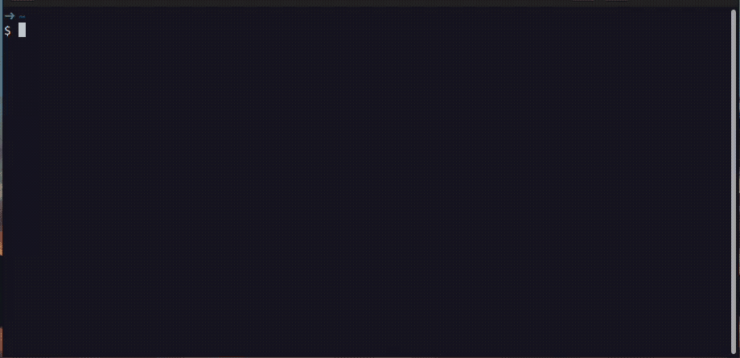

# Tbmk - Terminal bookmarker


A commands bookmark for terminal




## Worked on

- Linux: bash, zsh, fish
- Mac zsh

## Features

1. Bookmark manager.
2. Command placeholder. Allow to input value.

## How to use

- Press `Ctrl+T` to create an item
- Press `Tab/Shift+Tab` to switch between inputs
- Placeholder syntax: `{{name|default value}}`. name must be in `camelCase`
- Escaping Placeholder: `\{{name}}`
- Press `Ctrl+A` to select all placeholder value
- Press `Ctrl+Space` to search for items. You can type keywords before press `Ctrl+Space`
- In the result screen, select an item then press `Ctrl + D` to delete it
- Override the old one by add new command with the same title

The data are stored in `~/.tbmk`. You can backup or edit it directly.

## How to install

1. Download built file on release page
2. Extract the file. e.g. /somepath/tbmk
3. Run `cd /somepath/tbmk`
4. Run `./install` (don't install by execute `/absolute-path/install`), it will appends keybinding to `~/.bashrc`, `~/.zsh` and `~/.config/fish/config.fish`
5. Restart your shell or reload config file:
    - `source ~/.bashrc # bash`
    - `source ~/.zshrc # zsh`
    - `source ~/.config/fish/config.fish #fish`

## How to update

Just extract and override the old version's files

## Development

### Run

```shell
APP_ENV=dev go run . save
APP_ENV=dev go run . search
```

### Build

```shell
go build .
```

