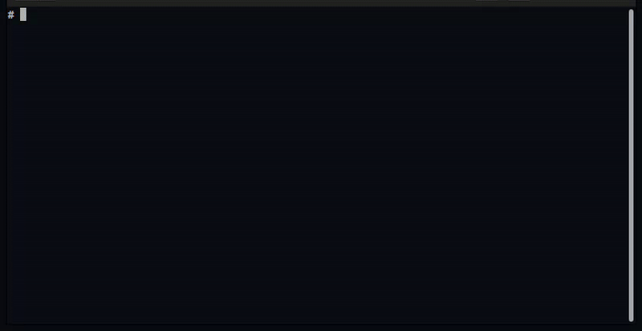

# Tbmk - Terminal bookmarker

A commands bookmark for terminal

# Tested on:
- [x] Ubuntu bash

# How to install
1. Download install file
2. Extract the file. e.g. /somepath/tbmk
3. Run `cd /somepath/tbmk`
4. Run `./install` will append keybinding to `~/.bashrc`

# How to use

1. Search: type and ctrl + space
2. Delete: in the result screen, select the item then press `ctrl+d`
3. Add: `ctrl + t`. you can type the command first then press `ctrl+t`

TODO

- [ ] Zsh
- [ ] Windows
- [ ] Mac
